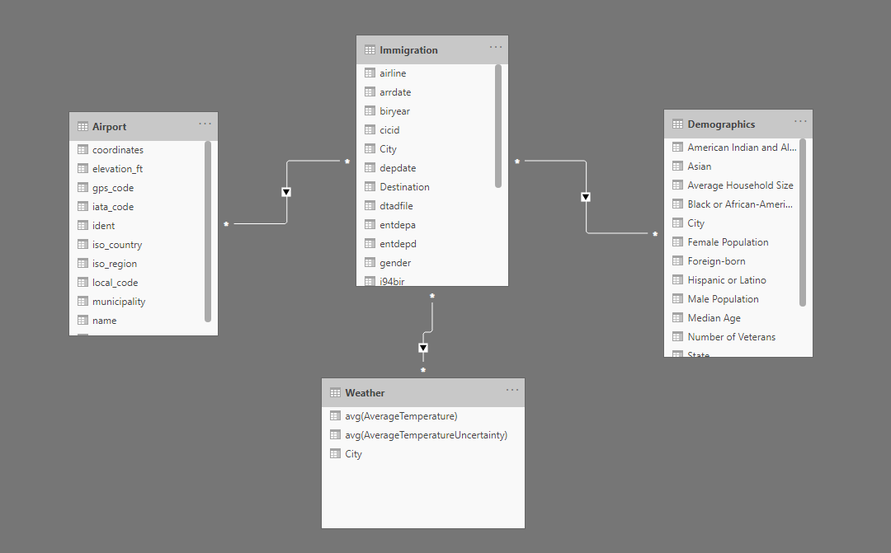
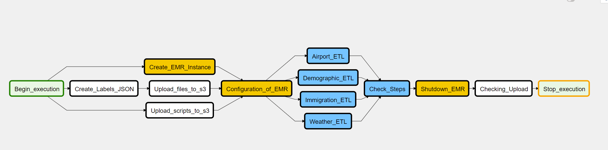

# Data Engineering Capstone Project

Author: Ashraf Ibrahim

Date: 18.04.2021

## Project Summary 

The aim of this project is to build a data model that enriches US immigration data. The data set on immigration in the USA will be enriched with demographic information of the cities that are the destination of the respective immigrants. Furthermore, the data model is enriched with information about the arrival airport and average weather information of the destination over the last ten years. 

Thus, this data model allows to gather basic information about arrivals, the point of arrival and the destination. 

## Technical Summary 

The data model is created within a data lake on AWS and orchestrated using Airflow. The implementation of the pipeline is initially set to run on a monthly basis. As part of this monthly process, the local data is uploaded to S3 an storage. I chose these tools because they give me a high degree of flexibility in terms of handling the amount of data (calculation capacity ) and orchestrating and scheduling the ETL-Pipeline.   

An EMR is initiated via the pipeline, which copies the data and manipulates all data records in such a way that the data model can be created from them. 

Finally, there is a re-upload to the S3 and a quality check of each file and upload.

## Project Structure 

```
Capstone-Project
│   README.md                           # Project description
│   docker-compose.yml                  # Docker Containers ETL 
|   inspect_airport.ipynb            	# Exploration and ETL-Strategy      
|   inspect_demographics.ipynb                            
|   inspect_immigration.ipynb
|	inspect_weater.ipynb
|__dags 
|  | capstone_dag.py				   # DAG for Airflow 
|__data
|  | GlobalLandTemperaturesByCity.csv  	# Weather Data (Download)     
│  | I94_SAS_Labels_Descriptions.SAS   	# Labels Data                       
│  | *.parquet                         	# Parquet Files for I94        
│  | us_cities_demographics.csv		    # Demographic Data
│  | airport-codes.csv                  # Airport Data
|__plugins
│   └──helpers                                
│   │    │──emr_instance.py              # IaC for EMR                 
|   └─── operators                   
│   │    |──clean_description.py   	    # Creates Dicts of Text Data 
│   │    |──upload_s3.py      		    # Upload Data to S3
|	|    |──check_upload.py             # Quality Check for Data Lake
│   └─── scripts                
│   │    |──airport_etl.py 			   # ETL Script for Airport-Data
|   |    |──i94_etl.py                  # ETL Script for Immigration Data
|   |    |──weather_etl.py              # ETL Script for Weather Data 
|   |    |──demographic_etl.py          # ETL Script for Demographic Data 
|   |    |──bucket.py				   # S3-Bucketname Class
|   |    |──python-modules.sh           # Shell Script for EMR-Modules
```


## Data Schema 

The schema consists of four Tables, whereas the Immigration Table equals the fact table and all others describe additional dimensions. 

| table name       | columns                                                      | description                                                  | type            |
| ---------------- | ------------------------------------------------------------ | ------------------------------------------------------------ | --------------- |
| Airport-Data     | ident - type - name - elevation_ft - iso_country - iso_region - municipality - gps_code - iata_code - local_code - coordinates | information related to airports                              | dimension table |
| Demographic-Data | city - state - Median Age - Male Population - Female Population - Total Population - Number of Veterans - Foreign-born - Average Household Size - State Code - American Indian and Alaska Native - Asian - Black or African-American - Hispanic or Latino - White | stores demographics data for cities                          | dimension table |
| Immigration-Data | cicid - i94yr - i94mon - i94cit - i94res - i94port - arrdate - depdate - i94bir - dtadfil - entdepa - entdepd - biryear - gender -  airline - visatype- Origin_Country - Travelmode - Destination - Visa - City | stores i94 immigrations data enriched by Dictionnary information | fact table      |
| Weather-Data     | City - City_AverageTemperature - City_AverageTemperatureUncertainty | Includes average Weahter per city, aggregated over the last 10 Years | dimension table |

The relations between the Tables are the following:

+ Immigration -> Demographics via City 
+ Immigration -> Weather via City 
+ Immigration -> Airport via iata_code/port_code 



### Data Dictionary  

#### Immigration 

| Field          | Desciption                     |
| -------------- | ------------------------------ |
| cicd           | Individual Number of Immigrant |
| i94yr          | Year of Arrival                |
| i94res         | Residency Code                 |
| i94port        | Port of Arrival                |
| arrdate        | Date of Arrival                |
| depdate        | Departure Date                 |
| i94bir         | Age of Immigrant               |
| dtadfile       | Datefield as Character         |
| entdepa        | Arrival Flag                   |
| entdepd        | Departure Flag                 |
| biryear        | Year of Birth of Immigrant     |
| gender         | Gender of Immigrant            |
| airline        | Airline of Arrival             |
| visatype       | Type of Visa                   |
| Origin_Country | Country of Origin              |
| Travelmode     | Mode of Travel                 |
| Destination    | State of Destination           |
| Visa           | General Visa Type              |
| City           | City of Arrival                |

### Airport 

| Field        | Description              |
| ------------ | ------------------------ |
| ident        | Identity Code of Airport |
| type         | Type of Airport          |
| name         | Name of Airport          |
| elevation_ft | Elevation in Feet        |
| iso_country  | Country Code             |
| iso_region   | Region Code              |
| municipality | Municipality Code        |
| gps_code     | GPS Code                 |
| iata_code    | IATA Code                |
| local_code   | Local Code               |

### Demographics 

| Field                             | Descritpion                       |
| --------------------------------- | --------------------------------- |
| city                              | City Name                         |
| state                             | State Name                        |
| Median Age                        | Median Age in City                |
| Male Population                   | Number of Male Population         |
| Female Population                 | Number of Female Population       |
| Total Population                  | Number of Total Population        |
| Number of Veterans                | Number of Veterans                |
| Average Household Size            | Average Size of Household         |
| State Code                        | Code of state                     |
| American Indian and Alaska Native | Number of People belongig to Race |
| Asian                             | Number of People belongig to Race |
| Black or African-American         | Number of People belongig to Race |
| Hispanic or Latino                | Number of People belongig to Race |
| White                             | Number of People belongig to Race |

### Weather 

| Field                              | Descritpion                                     |
| ---------------------------------- | ----------------------------------------------- |
| city                               | City Name                                       |
| City_AverageTemperature            | Average City Temperature over the last 10 Years |
| City_AverageTemperatureUncertainty | Average Uncertainty over the last 10 Years      |

## Airflow DAG 



The directed acyclic Graph consists of mutiple steps, the table below givs a detailed desciption. Each ETL-Steps has an own Quality-Check befor writing the data back to S3. 

| Operator             | Task                                                         |
| -------------------- | ------------------------------------------------------------ |
| Beginn_execution     | Dummy Operator                                               |
| Create_Labels_JSON   | Takes the SAS Description File and creates Dictionnaries of each variable. Thus descriptive Information can easily be mapped to the data. |
| Create_EMR_Instance  | Initiates the EMR Instance, based on the Configuration in the mentioned file above. |
| Upload_files_to_s3   | Uploads all files in \data folder to the S3 specified in the S3-Class, if files are not existent. |
| Upload_scripts_to_s3 | Uploads all scripts in \scripts folder to S3 specified in the S3-Class, if scripts are non existent. |
| Configuration of EMR | Specifies all Steps for EMR and runs the Shell Script for Cluster Config |
| Airport_ETL          | Runs the ETL Steps on the Airport Data; performs a Quality Check on the Data before storing to S3 |
| Demogrpahic_ETL      | Runs the ETL Steps on the Demographic Data; performs a Quality Check on the Data before storing to S3 |
| Immigration_ETL      | Runs the ETL Steps on the Immigration Data; performs a Quality Check on the Data before storing to S3 |
| Weather_ETL          | Runs the ETL Steps on the Weather Data; performs a Quality Check on the Data before storing to S3 |
| Check_Steps          | Checks if all EMR Steps are over befor shutting EMR down     |
| Shutdown_EMR         | Shutdown the EMR Instance                                    |
| Checking_Upload      | Checks if all files are uploaded to S3                       |
| Stop_execution       | Dummy Operator                                               |

## Project Instructions 

1. Clone this Repo 

2. Create an AWS-Account and an IAM-Role and a S3-Storage

3. Enter the Name of your S3 in ``bucket.py``.

4. Download the [Weather Data](https://www.kaggle.com/berkeleyearth/climate-change-earth-surface-temperature-data) and place it in the data Directory. All Other files are included! 

5. Download and Install Docker

6. Go to a Code editor of your Choice, open a Terminal and start Airflow by typing

   ```
   1. docker-compose up airflow-init
   2. docker-compose up
   ```

7. Open Airflow and enter you IAM credentials as a connection and name it **aws_credentials**, define your aws_region in the *Extra*-field ( e.g. {"region_name": "your_region"})

8. Start the Capstone DAG. 

## Requirements 

+ Docker (pulls Airflow)
+ Weather Data (download [here](https://www.kaggle.com/berkeleyearth/climate-change-earth-surface-temperature-data))
+ Modules for local Dictionnary preprocessing
  + Pandas 
  + Numpy 
+ AWS - Account 

## What would I do if ? 

+ The data was increased by 100% ?
  + As the Data is stored in S3, which is ment for storing large data, there is nothing to change here
  + The EMR should be enhanced by cores or should be replaced by a more powerfull EC2-Instance, to be able to handle the data. 
+ The Pipeline would be run on a daily basis by 7 am every day?
  + I would schedule airflow to run daily on a 7 am instead of the defined monthly schedule. 
+ The database needed to be accessed by 100+ people?
  + I would use a Database technology, for example Redshift. For this i would enhance the DAG with an RedshiftOperator and would write the Data from S3 to a Redshift Cluster, where i would be able to scale up and down in dependence to the amount of people interested in the Data.